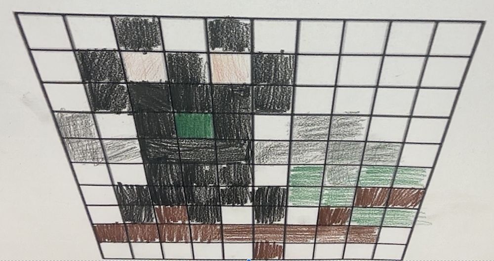
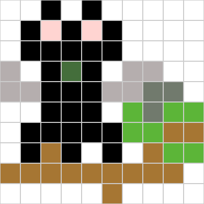

# Pixel art

## What I made

I was trying to draw a black cat with a green eye, but then it turned into a cursed bat and then into this.

## Real art

Here is the real art:

## Pixel art

Here is the computer art:

Here is the code for the computer art in hecxadecimal code:

0A  
0A  
18  
FFFFFF FFFFFF 000000 FFFFFF 000000 FFFFFF FFFFFF FFFFFF FFFFFF FFFFFF  
FFFFFF 000000 FFD4D1 000000 FFD4D1 000000 FFFFFF FFFFFF FFFFFF FFFFFF  
FFFFFF 000000 000000 000000 000000 000000 FFFFFF FFFFFF FFFFFF FFFFFF  
B5AEAE FFFFFF 000000 446E3B 000000 FFFFFF B5AEAE B5AEAE FFFFFF FFFFFF  
B5AEAE B5AEAE 000000 000000 000000 B5AEAE B5AEAE 717A6D 717A6D FFFFFF  
FFFFFF FFFFFF 000000 000000 000000 FFFFFF 5CB538 717A6D 5CB538 5CB538  
FFFFFF 000000 000000 000000 000000 000000 5CB538 5CB538 A67633 A67633  
FFFFFF 000000 A67633 000000 FFFFFF 000000 FFFFFF A67633 5CB538 5CB538  
A67633 A67633 A67633 A67633 A67633 A67633 A67633 A67633 A67633 FFFFFF  
FFFFFF FFFFFF FFFFFF FFFFFF FFFFFF A67633 FFFFFF FFFFFF FFFFFF FFFFFF 

Here it is in binary:

0000 1010  
0000 1010  
0001 1000  
111111111111111111111111 111111111111111111111111 000000000000000000000000 111111111111111111111111 000000000000000000000000 111111111111111111111111 111111111111111111111111 111111111111111111111111 111111111111111111111111 111111111111111111111111  
111111111111111111111111 000000000000000000000000 111111111101010011010001 000000000000000000000000 111111111101010011010001 000000000000000000000000 111111111111111111111111 111111111111111111111111 111111111111111111111111 111111111111111111111111  
111111111111111111111111 000000000000000000000000 000000000000000000000000 000000000000000000000000 000000000000000000000000 000000000000000000000000 111111111111111111111111 111111111111111111111111 111111111111111111111111 111111111111111111111111  
101101011010111010101110 111111111111111111111111 000000000000000000000000 010001000110111000111011 000000000000000000000000 111111111111111111111111 101101011010111010101110 101101011010111010101110 111111111111111111111111 111111111111111111111111  
101101011010111010101110 101101011010111010101110 000000000000000000000000 000000000000000000000000 000000000000000000000000 101101011010111010101110 101101011010111010101110 011100010111101001101101 011100010111101001101101 111111111111111111111111  
111111111111111111111111 111111111111111111111111 000000000000000000000000 000000000000000000000000 000000000000000000000000 111111111111111111111111 010111001011010100111000 011100010111101001101101 010111001011010100111000 010111001011010100111000  
111111111111111111111111 000000000000000000000000 000000000000000000000000 000000000000000000000000 000000000000000000000000 000000000000000000000000 010111001011010100111000 010111001011010100111000 101001100111011000110011 101001100111011000110011  
111111111111111111111111 000000000000000000000000 101001100111011000110011 000000000000000000000000 111111111111111111111111 000000000000000000000000 111111111111111111111111 101001100111011000110011 010111001011010100111000 010111001011010100111000  
101001100111011000110011 101001100111011000110011 101001100111011000110011 101001100111011000110011 101001100111011000110011 101001100111011000110011 101001100111011000110011 101001100111011000110011 101001100111011000110011 111111111111111111111111  
111111111111111111111111 111111111111111111111111 111111111111111111111111 111111111111111111111111 111111111111111111111111 101001100111011000110011 111111111111111111111111 111111111111111111111111 111111111111111111111111 111111111111111111111111  
