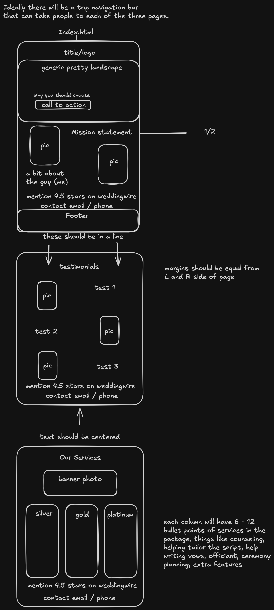

# Project process

## Initialization

I initialized this project on January 12th by making 3 empty files. These were index.html, style.css, and this page: process.md.

## Designing

Me and my client designed this project on January 13th when we client made the design in Excalidraw, as shown below.

## Coding begins

From January 14th to January 23rd, I was very productive

### January 14th

- The first commit of the day was to add serve.html and test.html as well as designing the head and navbar for all of my pages.
- The second commit was to fidget with the styling and adding the title and hero to index.html.
- The third update built all of index.html except for the footers using oly placeholder content and images and changed the name of serve.html to serv.html.
- The fourth commit fixed a few issues with the navbar.
- The fifth and final commit of the day was to make a form for serv.html to log requested services

### January 15th

- My first commit on January 15th was to fix one line of code where there was an error with the form in serv.html.
- My second commit of the day was to design a grid for test.html, as well as to add a warning for the serv.html form on how it works.
- The third commit I made that day was to test something in the serv.html for as well as to fix the navbar.
- The fourth commit was to get rid of the test from the third commit.
- The fifth commit was to make the form blur the background among other changes.

### January 16th

- The first commit on this day was to add placeholders to test.html, change some of the styling, and to make some changes to serv.html.
- The second commit of the day was to fix a problem where a scrollbar showed up on the navbar.

### January 20th

I stopped coding this for 4 days, then came back to add more.

- The first commit added collumns for the service levels on serv.html
- The second commit added the footers