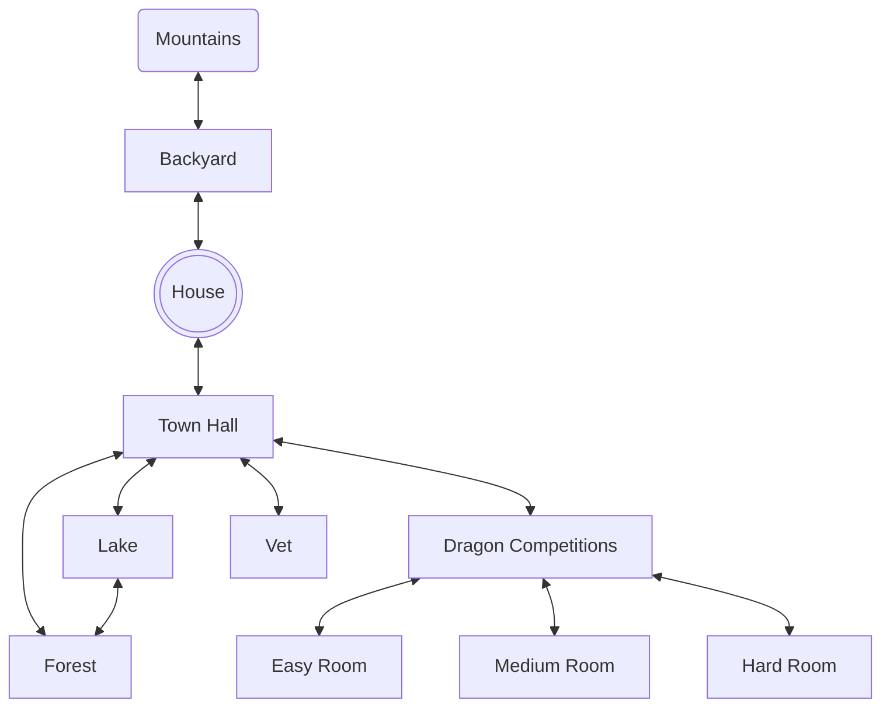

# Dragon Fighters

## Setting

This game takes place in a small town with dragons! There are multiple endings, but I won't give spoilers!

## Map

In the game, the player starts in the house. The mountains behind the house are hidden to begin with, so the player must look for them to find them.

## Global Variables

In this game, the most important global varialble are:

- hasDragon, which is a boolean checking if you have your dragon of not.
- hasDoggo, which is a boolean checking if you have the dog or not. If you have the dog, the battles run differently and  you can win much more easily.
- checkedIn, which checks if you have checked into the competition or not. If you haven't, then you are unable to enter the competition rooms.

## Story

In my game, you start out in your home, and when you look around, you see your pet dragon and a note saying to take said pet dragon to the vet. Along the way, you can find a poster for a dragon competition, and can then choose to go there instead of the vet. In the mountains, there is also a legendary dog that must be tamed with a stick from the forest. Once tamed, the dog replaces your dragon in combat and is invincible, dealing ∞ damage.
